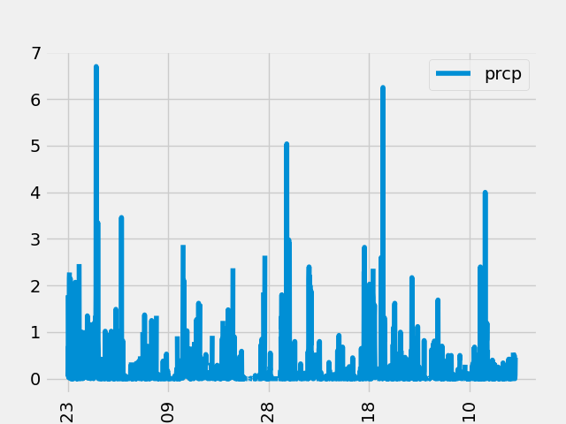

# sqlalchemy-challenge
Columbia University Data Analytics Bootcamp Module 10 Challenge

## About 
This project use SQLALCHEMY to connect to a SQLITE database using python. Through the SQLALCHEMY queries, the desired data is extracted and visualized.  
The queries will be used to create a API that will create queries based on user input.  

## Table of Contents
[Installation](#installation)  
[Visualization](#visualization)   
[Acknowledgements](#acknowledgements)  

## Installation 
    1. Clone repository on your local machine
    2. Open Jupyter Notebook
    3. Open .ipynb file 
    4. Run all cells
    5. Open app.py file
    6. Copy path
    7. paste path in browser

## Visualization

## Acknowledgements

- Thanks to Asiha Braxton-Garvin for helping me with the visualizations.  

